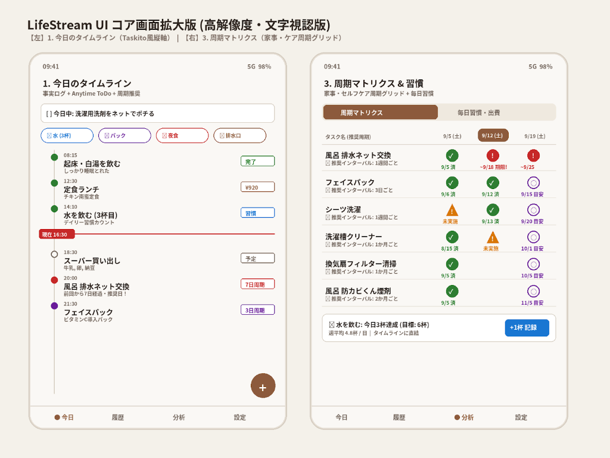

# LifeStream - Commercial MVP

Android向けライフログ＆ToDoアプリ「**LifeStream**」商用決定版MVPの実装リポジトリです。

## 概要
- **説教・反省のないフラットな事実記録**: 水、食事、夜食出費などを感情的な評価なしに淡々とログ化。
- **Taskito風の縦1本タイムライン**: 過去のDone、現在時刻（NOWライン）、未来のToDo、周期推奨タスクがシームレスに直結。
- **週マトリクス型周期トラッカー**: 排水口ネット交換、フェイスパック、フィルター清掃など長周期の家事・セルフケアを一元可視化。

## 主な機能
1. **今日のタイムライン (Tab 1)**:
   - Anytime ToDo カルーセル
   - クイック記録チップ（💧水, 🧖パック, 🍜夜食, 🧹排水口）＆ 5秒間Undo Snackbar
   - 縦軸タイムライン（緑丸、赤NOWライン、未来ToDo、周期推奨バッジ）
   - 自由記録FAB（ToDo/Done切替、金額入力、遡り時刻プリセット）
2. **履歴とカレンダー (Tab 2)**:
   - 全文検索（キーワード絞り込み ＋ 合計金額・件数集計）
   - 月間カレンダー（ログ存在日のドット表示、タップで日別全記録再現）
3. **周期マトリクス＆習慣 (Tab 3)**:
   - 週マトリクス（9/5, 9/12, 9/19のステータス可視化）
   - セルタップで即座に完了記録 ＆ タイムライン即時同期
   - 下部固定の水分補給トラッカー（+1杯記録ボタン）
4. **設定とカスタマイズ (Tab 4)**:
   - 3種テーマ即時切替（クラシック・ウォーム、ディープ・スレート、ピュア・ミニマル OLED）
   - 日付リセット境界時刻（デイカットオフ: デフォルト 午前04:00）
   - テンプレート管理
   - JSONバックアップエクスポート

## 技術スタック
- **言語**: Kotlin (Java 17)
- **UI**: Jetpack Compose (Material 3)
- **データベース**: Room SQLite (KSP) + Kotlin Coroutines Flow
- **日時管理**: kotlinx-datetime + java.time
- **シリアライズ**: kotlinx-serialization-json

## ビルド方法
`ash
./gradlew assembleDebug
`
ビルド完了後、pp/build/outputs/apk/debug/app-debug.apk が生成されます。
